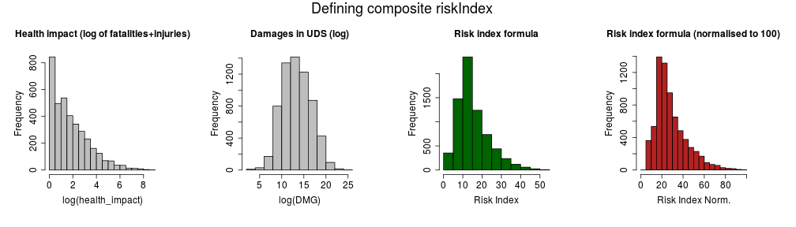

## App objectives and principle

The objective of this shiny app is to inform the user about the most critical severe weather risks which could be encoutered while travelling to a specific USA State during a specific month.

As inputs, the user have to select the month of travelling, an USA state of destination, the type of risk. Global risk index is selected per default, but one can choose health impact or damages impact

The app returns :

1. The most important severe weather event in term of impact (as selected by the user), with a map of USA showing where this type of weather event is the most active for the month
2. The estimation of what would be the best month to travel in this state
3. The estimation of what would be the best (safest) state to travel during this month

The app is available onn shinyapps : https://longwei.shinyapps.io/weather-shiny-app

--- .class #id 

## Data Source


The data used by this app is a cleaned and tidy data set of severe weather events in the US since 1950 evaluated from both financial and health impact cumed for each month of the year, each state and event type. Initial data is from the NOAA Storm Database (see 
http://rpubs.com/longwei66/87696 for details). This dataset is stored in the data frame `weather` which consists in 7039 of 11 variables. An extract is presented bellow.

<!-- html table generated in R 3.2.1 by xtable 1.7-4 package -->
<!-- Tue Jul 21 23:36:27 2015 -->
<table border=1>
<tr> <th>  </th> <th> month </th> <th> EVENT_TYPE </th> <th> STATE </th> <th> DMG </th> <th> health_impact </th> <th> riskIndex </th>  </tr>
  <tr> <td align="right"> 1 </td> <td align="right">   1 </td> <td> AVALANCHE </td> <td> AK </td> <td align="right"> 536000.00 </td> <td align="right">   6 </td> <td align="right"> 36.56 </td> </tr>
  <tr> <td align="right"> 2 </td> <td align="right">   1 </td> <td> AVALANCHE </td> <td> CA </td> <td align="right"> 0.00 </td> <td align="right">   6 </td> <td align="right"> 14.39 </td> </tr>
  <tr> <td align="right"> 3 </td> <td align="right">   1 </td> <td> AVALANCHE </td> <td> CO </td> <td align="right"> 401800.00 </td> <td align="right">  14 </td> <td align="right"> 41.72 </td> </tr>
   </table>

1. health_impact represent the sum of fatalities and injuries over the period for the month mentioned in column month
2. DMG is the total damages (crop and property) in USD over the period for the month
3. Risk index is an aggregated risk evaluation (see next slide)

--- .class #id 

## Risk Index

The risk index is a composite of log of total damages (crop and property) in USD and health impact (in number of injuries and fatalities) normalised to be between 0 and 100.

`riskIndex = (log(DMG + 1)/1.1 + 4 * log(health_impact + 1))`

`riskIndexNorm = riskIndex / max(riskIndex) * 100`

 


--- .class #id 

## Mapping the risks


To give better understanding of the risks, we have integrated a [choropleth map](https://en.wikipedia.org/wiki/Choropleth_map) of USA states, illustrating similar type of events risks.


```r
plot_weather_map(weather, eventType = "TORNADO", monthView = 5)
```

 

We have followed this excellent tutorial to design the risk mapping function 
[https://trinkerrstuff.wordpress.com](https://trinkerrstuff.wordpress.com/2013/07/05/ggplot2-chloropleth-of-supreme-court-decisions-an-tutorial/)

Our app code is available on github : [https://github.com/longwei66/](https://github.com/longwei66/severe-weather-usa-app/tree/master/weather-shiny-app)
